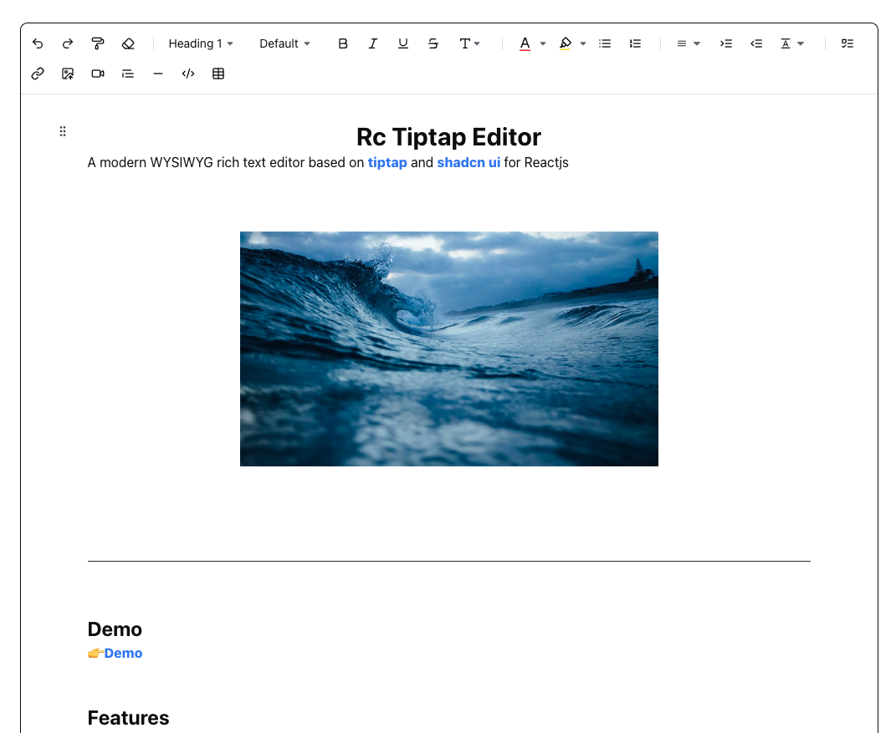

<p align="center">
<a href="https://www.npmjs.com/package/rc-tiptap-editor" target="_blank" rel="noopener noreferrer">
</a>
</p>

<p align="center">
 A modern WYSIWYG rich-text editor base on Tiptap uses Shadcn components.
</p>

<p align="center">
  <a href="https://www.npmjs.com/package/rc-tiptap-editor" target="_blank" rel="noopener noreferrer"></a>
  <a href="https://www.npmjs.com/package/rc-tiptap-editor" target="_blank" rel="noopener noreferrer"></a>
  <a href="https://bundlephobia.com/result?p=rc-tiptap-editor" target="_blank" rel="noopener noreferrer"></a>
  <a href="https://github.com/hunghg255/rc-tiptap-editor/graphs/contributors" target="_blank" rel="noopener noreferrer"></a>
  <a href="https://github.com/hunghg255/rc-tiptap-editor/blob/main/LICENSE" target="_blank" rel="noopener noreferrer"></a>
</p>



## Demo

[Demo](https://rc-tiptap-editor.vercel.app/)

## Features

- Use [shadcn](https://ui.shadcn.com/) components
- Markdown support
- TypeScript support
- I18n support(`en`, `vi`)
- Create your own extensions
- Tailwind CSS support
- Dark mode support
- Command support
- Table support
- Video support
- Image support
- Image upload support
- Video upload support
- Support emoji

## Installation

```bash
npm install rc-tiptap-editor
pnpm install rc-tiptap-editor
yarn add rc-tiptap-editor
```

## Usage

```tsx
import RcTiptapEditor, {
  BaseKit,
  History,
  Columns,
  FormatPainter,
  Clear,
  Heading,
  FontSize,
  Bold,
  Italic,
  Underline,
  Strike,
  MoreMark,
  Color,
  Highlight,
  BulletList,
  OrderedList,
  TextAlign,
  Indent,
  LineHeight,
  TaskList,
  Link,
  Image,
  ImageUpload,
  Video,
  VideoUpload,
  Blockquote,
  SlashCommand,
  HorizontalRule,
  ColumnToolbar,
  FontFamily,
  CodeBlock,
  Table,
  Code,
  locale,
} from 'rc-tiptap-editor';

import 'rc-tiptap-editor/style.css';

const extensions = [
  BaseKit.configure({
    placeholder: {
      showOnlyCurrent: true,
    },
    characterCount: {
      limit: 50_000,
    },
  }),
  History,
  Columns,
  FormatPainter,
  Clear,
  FontFamily,
  Heading.configure({ spacer: true }),
  FontSize,
  Bold,
  Italic,
  Underline,
  Strike,
  MoreMark,
  Color.configure({ spacer: true }),
  Highlight,
  BulletList,
  OrderedList,
  TextAlign.configure({ types: ['heading', 'paragraph'], spacer: true }),
  Indent,
  LineHeight,
  TaskList.configure({
    spacer: true,
    taskItem: {
      nested: true,
    },
  }),
  Link,
  Image,
  ImageUpload.configure({
    upload: (files: File) => {
      return new Promise((resolve) => {
        setTimeout(() => {
          resolve(URL.createObjectURL(files));
        }, 1000);
      });
    },
  }),
  Video,
  VideoUpload.configure({
    upload: (files: File[]) => {
      const f = files.map((file) => ({
        src: URL.createObjectURL(file),
        alt: file.name,
      }));
      return Promise.resolve(f);
    },
  }),
  Blockquote,
  SlashCommand,
  HorizontalRule,
  Code,
  CodeBlock.configure({ lowlight: createLowlight(common) }),
  ColumnToolbar,
  Table,
];

const DEFAULT = '';

const App = () => {
  const [content, setContent] = useState(DEFAULT);

  const onChangeContent = (value: any) => {
    setContent(value);
  };

  return (
    <RcTiptapEditor
      output='html'
      content={content as any}
      onChangeContent={onChangeContent}
      extensions={extensions}
    />
  );
};
```

## Props

```ts
interface IPropsRcTiptapEditor {
  content: string;
  extensions: AnyExtension[];
  output: 'html' | 'json' | 'text';
  modelValue?: string | object;
  dark?: boolean;
  dense?: boolean;
  disabled?: boolean;
  label?: string;
  hideToolbar?: boolean;
  disableBubble?: boolean;
  hideBubble?: boolean;
  removeDefaultWrapper?: boolean;
  maxWidth?: string | number;
  minHeight?: string | number;
  maxHeight?: string | number;
  editorClass?: string | string[] | Record<string, any>;
  contentClass?: string | string[] | Record<string, any>;
  onChangeContent?: (val: any) => void;
  useEditorOptions?: UseEditorOptions;
}
```

## Run Locally

Clone the project

```bash
git clone https://github.com/hunghg255/rc-tiptap-editor.git
```

Go to the project directory

```bash
cd rc-tiptap-editor
```

Install dependencies

```bash
pnpm install
```

Start the Demo server

```bash
npm run build:lib:dev
npm run playground
```

## Related

Here are some related projects

[Tiptap](https://tiptap.dev)

[Shadcn](https://ui.shadcn.com/)

[echo-editor](https://github.com/Seedsa/echo-editor)

## License

[MIT](./LICENSE)
